<picture>
  <source media="(prefers-color-scheme: dark)" srcset="./assets/glow-dark.svg" />
  <source media="(prefers-color-scheme: light)" srcset="./assets/glow-light.svg" />
  
</picture>

  <a href="https://github.com/HehexOne?tab=repositories">Repositories ↗</a>

